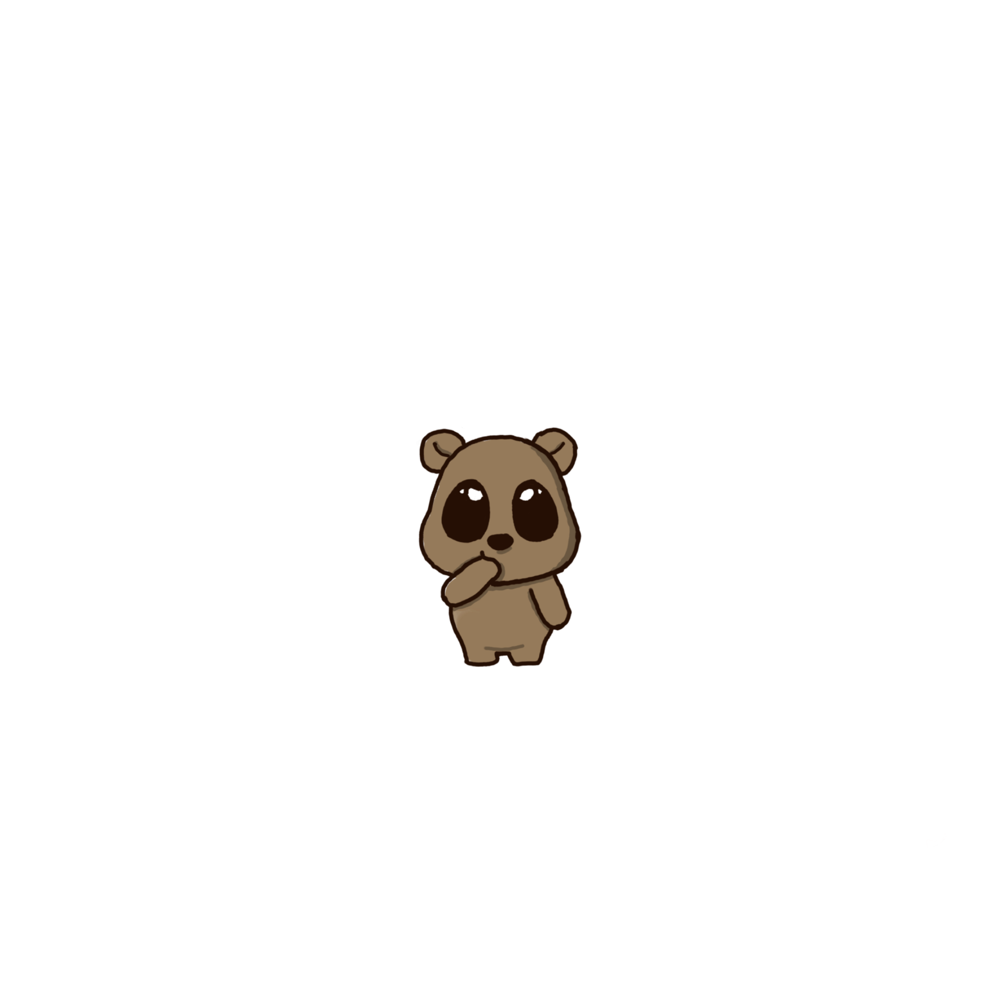
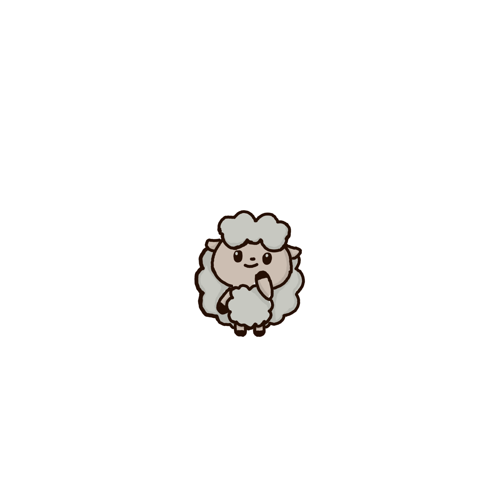

# Napkin

A sticky note cross-platform desktop application developed using Electron, Vite 2, Vue 3, TypeScript, and Electron Builder.

Napkin is named after *"napkin notes,"* which refers to casual handwritten notes made on a napkin or any available piece of paper. It captures the essence of impromptu ideas.

## User Interface (How Napkin Differs from Traditional Sticky Note Apps)

- Drops down and is shaped like a rectangular napkin.
- Window can be hidden or locked.
- Offers a transparent and customizable background.
- Acts as a todo or reminder app as well.

## Preview


## Included Features

- [x] Window automatically hides when docked to the edge.
- [x] Auto-starts with the system.
- [x] Lock the window by clicking the lock icon.
- [x] Customize settings to control window behavior in relation to other applications.
- [x] Minimize the window by clicking ***-***.
- [x] Add notes by clicking ***+ Note***.
- [x] Set reminders by clicking the clock icon.
- [x] Mark tasks as complete by checking the box.
- [x] Right click options include *Edit*, *Complete*, *Undo Complete* *Add/Modify Reminder*, *Copy*, and *Delete*
- [x] Click ***✓*** to view completed tasks
- [x] Click ***→*** to view future tasks
- [x] Click ***⌫*** to view deleted tasks
- [x] Click ***⚠*** to view overdue tasks
- [x] Change or reset the background by clicking ***+ Background***.
- [ ] ..........

## Napkin Friends 

A series of 3 stickers launched with Napkin (art created by [@kimuchicat](https://github.com/kimuchicat)).





These stickers are provided as default options that can be set as the background. 

Gif versions coming soon. 
 
## Steps to Run the Program

```
yarn or npm install
yarn dev or npm run dev
yarn build or npm run build
```

## Known Issues & Development

- Each note supports a maximum of 200 characters.
- Sound/audio settings are not functional at the moment.
- *Permanetly delete* feature does not work when a note is placed under  ***→*** or ***⚠***
- To change the background colo, update the hex value within the **.home** class in the **index.vue** file located in the **Home** directory:
```
background: fade(#[desired hex color], 50%);
```
from
```
.home {
  position: relative;
  width: 100%;
  height: 100%;
  background: fade(#414141, 50%);
  transition: all 0.3s ease-out;
}
```
- To change the background sticker options to reflect your desired images or gifs, upload the files to the **Public** directory and update the array with the corresponding file names: 
```
```
const stickers = ["sticker.png", "sticker1.png", "sticker2.png"];
```
from
```
// Stickers
const stickers = ["sticker.png", "sticker1.png", "sticker2.png"];
const selectedSticker = ref(null);
const stickerPickerVisible = ref(false);
function showStickerPicker() {
  stickerPickerVisible.value = true;
}
```
- Resizing of the window may cause issues when a background is set.
- Proportions of the stickers need to be improved.
- Running multiple instances of Napkin requires launching separate instances of the program.

## Future Add-On Ideas (That Might Require Further Exploration)
- Enabling collaboration on Napkin.
- Leveraging large language models to provide analysis of weekly deleted or completed notes.
- Implementing more animations, such as a visual representation of a napkin being folded up and tossed in a trash bin.